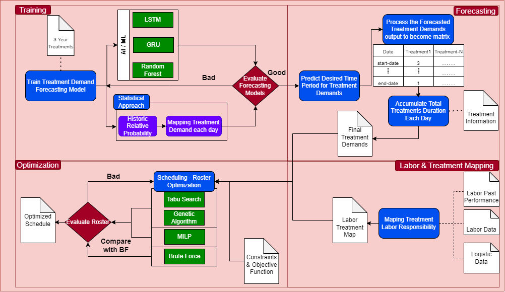

# Dental Clinic Optimization

## Objective
This simulation repository was used to understand the condition of each dental clinic to maximizing their profit by acknowledging opportunity and pattern by optimization method in many sectors such as Financial Modeling, Revenue Projection, Labor Roster Scheduling, Optimized Appointment Schedule, Resource Allocation, Treatment Demand Forecasting, Labor Performance Assesment, and many more optimization method we used for this project

## General Workflow
1. You can use any python version, recommended **Python 3.8++**
2. Install python necessary dependencies from **requirements.txt**
3. Run the simulation app, for local run please run **Main_streamlit.py** or you can deploy it in cloud using AWS elasticbeanstalk or any other cloud service you want, i think you might need to reiniate the elasticbeanstalk if you want to try (delete the .elasticbeanstalk folder)
4. To understand the simulation workflow please read the documentation
5. There is also endpoint version to get some optimization request in **Flask** Folder

## Scheduling Appointment Optimization
Check **Test_coding.ipynb** file for this matter
## V1 Simulation from 6 Month Treatment Demand Dummy
- Treatment Scenario data is from Data/Dummy_Scenario.csv this file was generated from **Dummy_scenario_generator.py**
- Treatment Information data is from Data/Service_list.xlxs
- Treatment rule, constraints and Labor Information is from Data/TaskClassfication.xlxs
- Run the jupyter notebook below "Run Sheet Scheduling V1"
- The output look like clinic_scheduleV1.xlxs

## V2 Simulation from 6 Month Treatment Demand Dummy, but more detail using item numbers
- Treatment Scenario data is from **Scenario_itemNumber.csv** or **Scenario_itemNumber2.csv** 
- Treatment Information data **treatment_precedence.json**
- Treatment rule, constraints and Labor Information is from Data/TaskClassficationV2.xlxs or TaskClassificationV2-2.xlxs
- Run the jupyter notebook below "Run Sheet Scheduling V3"
- The output look like clinic_scheduleV2.xlxs

## V3 Simulation from past australian dental clinic treatments data
- Treatment Scenario data is from Data/Real/DES - Clarity Dental.xlxs (pre-process) -> Data/Real/Model_Input_Preprocess2.csv
- Treatment rule, constraints and Labor Information is from Data/TaskClassfication_exp.xlxs
- Run the jupyter notebook below "Run Sheet Scheduling V3"
- The output look like clinic_scheduleV3.xlxs

check **Output** folder to see the Scheduling Appointment Optimization output files

## Scheduling Optimization Pipeline

## Preprocessing Code
There is Preprocessing code to process raw past dental clinic treatments hostory data to be feed into Run Sheet Scheduling
- The code is inside **Input_Preprocessing.ipynb**

## Flask endpoint
- To run this endpoint, move to **Flask** foldear
- Run the **Main.py** file to run the clinic endpoint server
    endpoint description:
    - **/forecast_scenario**, generate scenario prediction for predicting treatment demand (used for Scheduling Appointment Optimization V1)
    - **/optimize_schedule**, generate dentist roster data based on treatment demand (this version was beofore Scheduling Appointment Optimization V1)
    - **/performance_evaluation**, get dentist performance evaluation for certain treatment  based on previous history (this version was beofore Scheduling Appointment Optimization V1)
    - **/performance_evaluation_chart** get dentist history of treatment duration trend/chart
    - **/analyze_dentist_history** get 4 payloads, first 3 payloads are speciality metrics: 
        1. Each dentist average treatment duration (from past data)
        2. Each dentisht treatment efficiency increase (from past data)
        3. Each dentist treatment performance score (from past data (the formula is in the report ppt file))
        4. Last payload is dentist treatment speciality decision output
    - **/profit_optimization** get clinic financial projection based on historical treatment demands
    - **/run_sheet_optimization_v2-2** endpoint request to get run sheet scheduling V2-2 (inside **test_coding.ipynb** file)
- Check the **Flask_test.ipynb** file to test & understad the payload input for these endpoints

